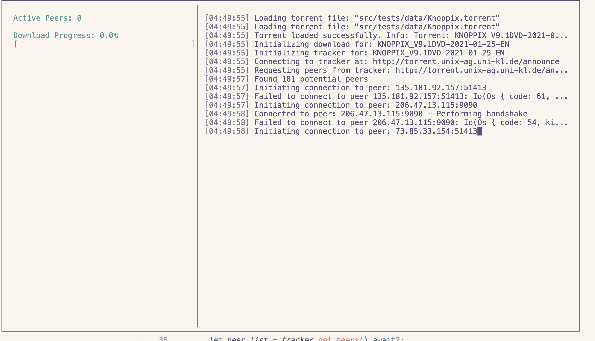

# Introduction

Our project involved writing a barebones bittorrent client. We knew going into the project that it was an ambitious task to take on, so we tried to simplify it as much as possible without making the project trivial. Our goal was for the client to have four basic functionalities:

- Parse a local .torrent file and obtain necessary metadata required to download the content
- Connect to tracker and peers via TCP
- Download content from peers in pieces a failsafe manner
- Act as a seeder after completing the download

In the end, we were able to achieve the first three goals. Our client is a command line call with the .torrent file as its argument, and it displays download progress and important information such as peer count and their addresses. We ended up running out of time to do seeding, but we learned a ton just from completing a leeching client.

# Design/Implementation

### Parsing .torrent files

Our client uses the Serde library to decode .torrent bencode files that contain

- Tracker (announce) URL
- File information like the name, total length, and piece length
- Info hashes for each piece to verify validity of data received from peers
- File mode: single or multi

An example of the contents of a torrent file:

```
Torrent {
    announce: "my-announce-url.com/announce",
    info: Info {
        name: "file.txt",
        piece_length: 32768,
        pieces: PieceHashes([[Hash of piece 1], [Hash of piece 2], [Hash of piece 3],...]),
        files: SingleFile { length: 92063 }
    },
    info_hash: Some([214, 159, 145, 230, 178, 174, 76, 84, 36, 104, 209, 7, 58, 113, 212, 234, 19, 135, 154, 127])
}
```

Source code: from_file in [torrent.rs](./src/torrent.rs)


In this terminal output, we can clearly see a multi file torrent with its various parts decoded. This is what we use to query the tracker and go further into connecting with the peers. But here you can see there aren't any peers which was an issue we faced early on. To prevent this, we started to use well seeded peers and mostly linux distributions.


Here is a torrent with no peers.

### Communicating With Trackers

To begin the download process, our client sends a request to the tracker url to retrieve the list of peer addresses. The request contains identifying information for the client like its id and port it's listening on, along with the info hash of the content it wants to download. The request URL looks something like:

```
http://my-announce-url.com/announce?info_hash=infohash&peer_id=peerid&port=6881&uploaded=0&downloaded=0&left=92063&compact=1&event=started
```

Where info hash and peer ID are hex numbers like: %d6%9f%91%e6%b2%ae%4c%54%24%68%d1%07%3a%71%d4%ea%13%87%9a%7f.

Source code: get_peers in [tracker.rs](./src/tracker.rs)


Here we can see the potential peers found from querying the tracker url. We use the announce url `http://torrent.unix-ag.uni-kl.de/announce` to connect to the tracker at that url and request peers with info hash `%c0%3b%b7%09%bd%7e%fe%79%68%87%75%4%fc%92%
51%41%491d8b2%87` and `peer_id=82d852853830%30%30%3182d%58%34%e0%6c&c7%bb%d1&e0%17%0a%8848&port=6881&uploaded=0&down loaded=0&left=
4695273319&compact=1&event=started`. We get a `200 0K` response with successful decoding of 205 potential peers.

### Connecting to Peers

#### Handshake

After retrieving the addresses and ports of the peers, our client is ready to begin leeching. It initiates a handshake protocol with each of the peers, and connects using TCP. The handshake struct contains the fields that are needed to establish the protocol between peers:

```
{
    pstrlen: 19,
    pstr: *b"BitTorrent protocol",
    reserved: [0; 8],
    info_hash,
    peer_id,
}
```

Essentially, peers need to determine compatibility with one another and to inform each other of what protocol they are using to exhange information. Since we are implementing the bittorrent protocol, we have hardcoded the fields. The reserved bytes are also standard, and they are for future extensibility. The info hash must match to make sure both peers are exchanging the same content, and the peer id identifies the sender to others in the swarm (group that's exhanging the same torrent).


#### Exchanging Messages

There are 9 message types in our implementation:

```
pub enum MessageId {
    Choke = 0,
    Unchoke = 1,
    Interested = 2,
    NotInterested = 3,
    Have = 4,
    Bitfield = 5,
    Request = 6,
    Piece = 7,
    Cancel = 8,
}
```

Each message type pertains to controlling the flow of data or sending it.

- Choke and unchoke messages are sent when the sender is willing and unwilling to send more messages to the recipient
- Interested and NotInterested are used to indicate when a peer is willing or unwilling to receive pieces
- The Have message tells its recipient that a specific piece has been downloaded by the sender of the message
- Bitfield is sent immediately after the handshake to inform the recipient of which pieces the sender has. It contains a bitstring, and the it is set to 1 at the indices where the sender has the corresponding piece. The length is the total number of pieces in the torrent.
- Request requests a specific piece from the recipient of the message
- Piece is sent in response to a request message with a payload containing the requested piece
- Cancel cancels a request

#### Downloading Content

After the connection is established and the client has the peer's bitfield we begin downloading pieces. The source code for this process lies within [download.rs](./src/download.rs). In order to download concurrently, we create a channel that notifies the main thread (which has called the download_all function) when a piece has been downloaded. Then, in start_download_tasks, we iterate through all of the peers and spawn threads that begin the download process. Each of these threads sends PieceCompleted or PieceFailed messages to the channel when a piece has either finished downloading or failed somewhere.

To actually download pieces, the client sends an interested message and waits for the peer to send an unchoke message. When the unchoke message is received, the client can now begin downloading. To protect against bad peers, each downloaded piece's hash is verified with the piece hashes from the .torrent file.

At the end, we check a vector containing failed pieces, and if it contains pieces, we iterate through every peer that has this piece to try to retrieve this missing piece. Finally, we write all the pieces to a file in the client's local file system with the .out extension.


Initially we also found an issue where if a peer fails (for example, with a `Broken Pipe`), it constantly spams because of the retransmissions. So, we implemented a max retries limit before closing the peer connection.


### Discussion and Results

### Conclusions and Future Work

After torrenting files in our own lives, we were curious about how it exactly works and where its dangers lie, leading to this project idea. By developing our own client, we learned a lot about the bittorrent protocol and how peer to peer file sharing works. We realized that even though torrent clients look very simple on the surface, there are quite a lot of complex operations going on at the network level. We also learned that the bittorrent protocol is unsafe these days due to the use of SHA1 as its hashing algorithm, making it susceptible to hash collision attacks. Thankfully, a lot of modern torrent clients have migrated to SHA256. We felt like we struck a good balance on how challenging this project was, it didn't feel extremely trivial or way too hard. For future work, the first step would definitely be including seeding functionality after a client downloads the content. It would also be nice to have an actual UI, as well as support for pausing and resuming downloading. A difficult but interesting thing to add would be DHT, which would allow our client to connect to peers without using a central tracker.

For future work, we could implement partial download data write to the output file. Currently it waits for the download to complete but a partial downlad would ensure that we can acutally observe the writes happening. We also started to implement a better user expereince through `crossterm` in `new-ui` branch but it is still riddled with concurrency issues. 


